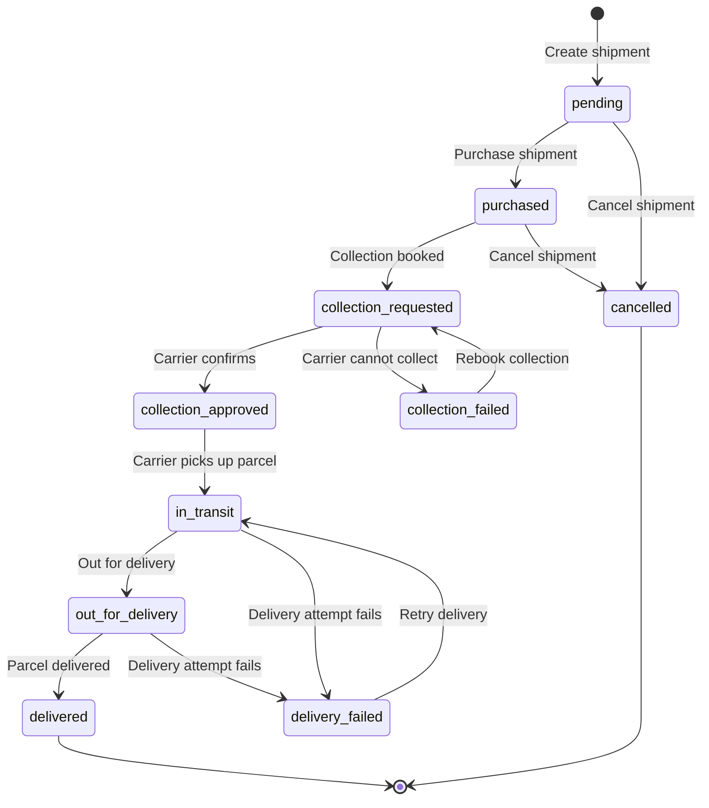

A shipment moves through a predictable series of statuses as it progresses from draft to delivery. Understanding these statuses lets you build accurate order-tracking UIs and handle edge cases like failed collections or deliveries.

## Status flow diagram

## Status reference

| Status                  | Description                                                                                           | Available actions                      | Next status                                              |
| ----------------------- | ----------------------------------------------------------------------------------------------------- | -------------------------------------- | -------------------------------------------------------- |
| `pending`               | Shipment created as a draft. No carrier assigned, no label generated.                                 | Edit, delete, purchase, cancel.        | `purchased`, `cancelled`                                 |
| `purchased`             | Label purchased. A carrier and waybill number have been assigned.                                     | Cancel (before collection is booked).  | `collection_requested`, `cancelled`                      |
| `collection_requested`  | A collection has been booked with the carrier. The carrier is scheduled to pick up the parcel.        | Wait for carrier confirmation.         | `collection_approved`, `collection_failed`               |
| `collection_approved`   | The carrier has confirmed the collection. Pickup is imminent or has occurred.                         | None -- in carrier's hands.            | `in_transit`                                             |
| `collection_failed`     | The carrier attempted collection but was unable to pick up the parcel (e.g. premises closed, address not found). | Rebook collection or contact support.  | `collection_requested`                   |
| `in_transit`            | The parcel is in the carrier's network, moving toward the delivery address.                           | Track via API or webhook.              | `out_for_delivery`, `delivery_failed`                    |
| `out_for_delivery`      | The parcel is on the delivery vehicle and will be delivered today.                                    | Track via API or webhook.              | `delivered`, `delivery_failed`                           |
| `delivered`             | The parcel has been delivered to the recipient. This is a terminal status.                            | None.                                  | --                                                       |
| `delivery_failed`       | The carrier attempted delivery but could not complete it (e.g. recipient not available, wrong address). | Contact carrier or wait for retry.    | `in_transit`                                             |
| `cancelled`             | The shipment was cancelled by the user. This is a terminal status.                                   | None.                                  | --                                                       |

## Status details

### pending

The shipment exists as a draft. You created it with `purchase_label: false` (or it has not been purchased yet). At this stage you can freely edit any detail -- addresses, parcels, service type -- or delete the shipment entirely.

### purchased

You (or your system) called the purchase endpoint. Evership has assigned a carrier, generated a waybill number, and deducted the shipping cost from your balance. The label is now available for download. You can no longer edit or delete the shipment, but you may still cancel it before collection is booked.

### collection_requested

A collection has been scheduled with the assigned carrier. This typically happens automatically after purchase. The carrier will attempt to collect the parcel from the collection address within the agreed timeframe.

### collection_approved

The carrier has confirmed the collection booking. This means the driver is on the way or has already picked up the parcel. From this point the shipment is physically in the carrier's possession.

### collection_failed

The carrier attempted to collect but could not. Common reasons include the premises being closed, the parcel not being ready, or the address being inaccessible. You can rebook collection or contact support for assistance.

### in_transit

The parcel is moving through the carrier's sorting and delivery network. Depending on the distance and service level, this stage may last from a few hours to several days.

### out_for_delivery

The parcel has been loaded onto a delivery vehicle and is on its way to the recipient. Delivery is expected the same day.

### delivered

The parcel has been successfully handed over to the recipient. This is a terminal status -- no further transitions occur.

### delivery_failed

The carrier could not deliver the parcel. Reasons include the recipient not being available, an incorrect address, or the parcel being refused. The carrier may automatically retry, moving the shipment back to `in_transit`.

### cancelled

The shipment was cancelled before the carrier collected it. The label is void and any charges may be refunded depending on the cancellation policy. This is a terminal status.

## Tracking these statuses

There are two ways to stay informed about status changes:

1. **Polling** -- Call `GET /shipments/tracking-status?shipment_ids=...` on a schedule. Good for simple integrations or back-office dashboards.

2. **Webhooks** -- Register a webhook for the `tracking_status` event via `POST /webhooks`. Evership will POST to your URL every time a shipment's status changes. This is the recommended approach for production integrations because it is real-time and does not require polling.

See the [Tracking API reference](/api-reference/tracking/tracking-status) and [Webhooks API reference](/api-reference/webhooks/create-webhook) for full details.
