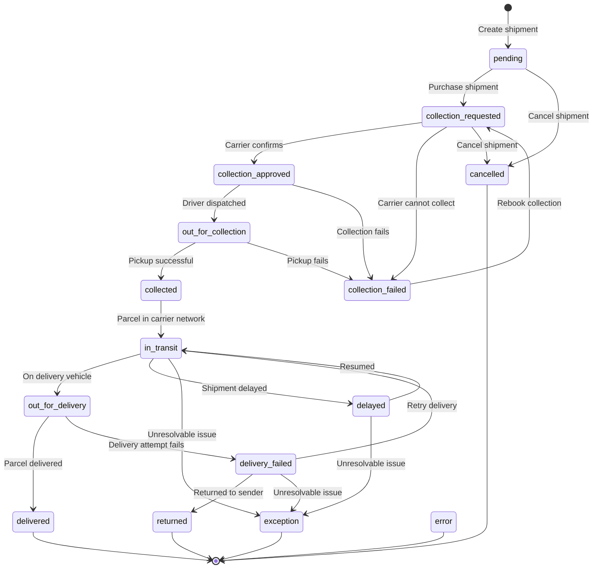

A shipment moves through a predictable series of statuses as it progresses from draft to delivery. Understanding these statuses lets you build accurate order-tracking UIs and handle edge cases like failed collections or deliveries.

## Status flow diagram

## Primary statuses

These are the main statuses that track a shipment through its lifecycle.

| Code | Status | Slug | Description |
| --- | --- | --- | --- |
| 1 | **Pending** | `pending` | Shipment record created but not purchased |
| 2 | **Collection requested** | `collection_requested` | Shipment has been purchased and collection request submitted to carrier |
| 3 | **Collection approved** | `collection_approved` | Carrier has approved the collection request |
| 4 | **Out for collection** | `out_for_collection` | Carrier is on the way to collect the shipment from its pickup address |
| 5 | **Collected** | `collected` | Carrier completed collection of the shipment successfully |
| 6 | **Collection failed** | `collection_failed` | Carrier attempted collection of the shipment but was unsuccessful |
| 7 | **In transit** | `in_transit` | Any movement of the shipment that is not `out_for_collection` or `out_for_delivery` |
| 8 | **Out for delivery** | `out_for_delivery` | Carrier is on the way to deliver the shipment to its drop off address |
| 9 | **Delivered** | `delivered` | Carrier completed delivery of the shipment successfully |
| 10 | **Delivery failed** | `delivery_failed` | Carrier attempted delivery of the shipment but was unsuccessful |
| 11 | **Returned** | `returned` | Carrier has returned the shipment to the sender |
| 12 | **Exception** | `exception` | Shipment was unable to be delivered successfully or returned to the sender |
| 13 | **Cancelled** | `cancelled` | Shipment cancelled by carrier or user |
| 14 | **Error** | `error` | Error received from carrier tracking |
| 15 | **Delayed** | `delayed` | Shipment has been delayed in transit |

## Status details

### pending

The shipment exists as a draft. You created it with `purchase_label: false` (or it has not been purchased yet). At this stage you can freely edit any detail — addresses, parcels, service type — or delete the shipment entirely.

**Available actions:** Edit, delete, purchase, cancel.

### collection_requested

You (or your system) called the purchase endpoint. Evership has assigned a carrier, generated a waybill number, and deducted the shipping cost from your balance. The label is now available for download. A collection has been scheduled with the assigned carrier.

**Available actions:** Cancel (before collection is approved).

### collection_approved

The carrier has confirmed the collection booking. This means the driver is scheduled to collect and pickup is imminent.

**Available actions:** None — in carrier's hands.

### out_for_collection

The carrier driver has been dispatched and is on the way to collect the shipment from the pickup address.

**Available actions:** None — in carrier's hands.

### collected

The carrier has successfully picked up the parcel from the collection address. The shipment will move to `in_transit` as it enters the carrier's sorting and delivery network.

**Available actions:** Track via API or webhook.

### collection_failed

The carrier attempted to collect but could not. Common reasons include the premises being closed, the parcel not being ready, or the address being inaccessible. You can rebook collection or contact support for assistance.

**Available actions:** Rebook collection or contact support.

### in_transit

The parcel is moving through the carrier's sorting and delivery network. Depending on the distance and service level, this stage may last from a few hours to several days.

**Available actions:** Track via API or webhook.

### out_for_delivery

The parcel has been loaded onto a delivery vehicle and is on its way to the recipient. Delivery is expected the same day.

**Available actions:** Track via API or webhook.

### delivered

The parcel has been successfully handed over to the recipient. This is a **terminal status** — no further transitions occur.

**Available actions:** None.

### delivery_failed

The carrier could not deliver the parcel. Reasons include the recipient not being available, an incorrect address, or the parcel being refused. The carrier may automatically retry, moving the shipment back to `in_transit`, or the shipment may be returned to the sender.

**Available actions:** Contact carrier or wait for retry.

### returned

The carrier has returned the shipment to the sender. This typically happens after one or more failed delivery attempts. This is a **terminal status**.

**Available actions:** None.

### exception

The shipment was unable to be delivered successfully or returned to the sender. This status indicates an unresolvable issue that requires manual intervention. This is a **terminal status**.

**Available actions:** Contact support.

### cancelled

The shipment was cancelled by the user or the carrier before the parcel was collected. The label is void and any charges may be refunded depending on the cancellation policy. This is a **terminal status**.

**Available actions:** None.

### error

An error was received from carrier tracking. This typically indicates a problem on the carrier's side rather than with the shipment itself. This is a **terminal status**.

**Available actions:** Contact support.

### delayed

The shipment has been delayed in transit. This can occur due to carrier capacity issues, weather, or other external factors. The shipment will typically resume movement and return to `in_transit`.

**Available actions:** Track via API or webhook, contact support if prolonged.

## Tracking these statuses

There are two ways to stay informed about status changes:

1. **Polling** — Call `GET /shipments/tracking-status?shipment_ids=...` on a schedule. Good for simple integrations or back-office dashboards.

2. **Webhooks** — Register a webhook for the `tracking_status` event via `POST /webhooks`. Evership will POST to your URL every time a shipment's status changes. This is the recommended approach for production integrations because it is real-time and does not require polling.

See the [Tracking API reference](/api-reference/tracking/tracking-status) and [Webhooks API reference](/api-reference/webhooks/create-webhook) for full details.
