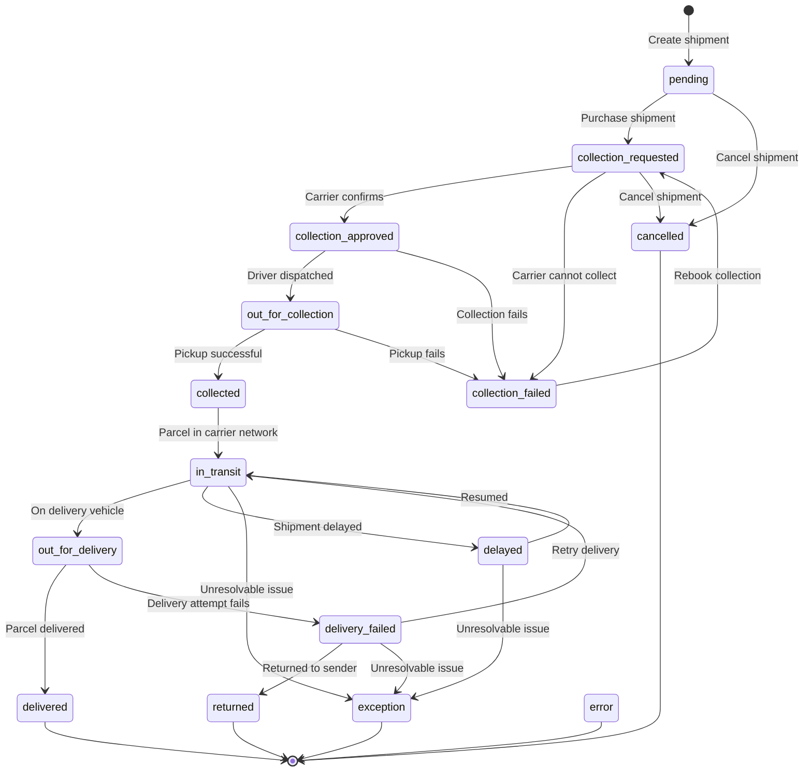

A shipment moves through a predictable series of statuses as it progresses from draft to delivery. Understanding these statuses lets you build accurate order-tracking UIs and handle edge cases like failed collections or deliveries.

## Status flow diagram

## Primary statuses

These are the main statuses that track a shipment through its lifecycle.

| Code | Status | Slug | Description |
| --- | --- | --- | --- |
| 1 | **Pending** | `pending` | Shipment record created but not purchased |
| 2 | **Collection requested** | `collection_requested` | Shipment has been purchased and collection request submitted to carrier |
| 3 | **Collection approved** | `collection_approved` | Carrier has approved the collection request |
| 4 | **Out for collection** | `out_for_collection` | Carrier is on the way to collect the shipment from its pickup address |
| 5 | **Collected** | `collected` | Carrier completed collection of the shipment successfully |
| 6 | **Collection failed** | `collection_failed` | Carrier attempted collection of the shipment but was unsuccessful |
| 7 | **In transit** | `in_transit` | Any movement of the shipment that is not `out_for_collection` or `out_for_delivery` |
| 8 | **Out for delivery** | `out_for_delivery` | Carrier is on the way to deliver the shipment to its drop off address |
| 9 | **Delivered** | `delivered` | Carrier completed delivery of the shipment successfully |
| 10 | **Delivery failed** | `delivery_failed` | Carrier attempted delivery of the shipment but was unsuccessful |
| 11 | **Returned** | `returned` | Carrier has returned the shipment to the sender |
| 12 | **Exception** | `exception` | Shipment was unable to be delivered successfully or returned to the sender |
| 13 | **Cancelled** | `cancelled` | Shipment cancelled by carrier or user |
| 14 | **Error** | `error` | Error received from carrier tracking |
| 15 | **Delayed** | `delayed` | Shipment has been delayed in transit |

## Secondary statuses

Secondary statuses provide more granular detail within a primary status. They appear in the `secondary_status` field of tracking events.

| Code | Primary Status | Secondary Status | Slug | Description |
| --- | --- | --- | --- | --- |
| 4A | Out for collection | **Arrived to collect** | `arrived_collection` | Carrier driver has confirmed their arrival at the pickup address |
| 7A | In transit | **Processed at hub** | `hub_processed` | Parcel has been scanned and processed at a carrier sorting hub |
| 7B | In transit | **Delivery date calculated** | `delivery_date_calculated` | Carrier has calculated the estimated delivery date |
| 7C | In transit | **Delivery scheduled** | `delivery_scheduled` | Delivery has been scheduled for a specific date |
| 8A | Out for delivery | **Arrived to deliver** | `arrived_deliver` | Carrier driver has confirmed their arrival at the drop off address |
| 10A | Delivery failed | **Returning** | `returning` | Carrier driver is on the way to the return address |
| 10B | Delivery failed | **Arrived to return** | `arrived_return` | Carrier driver has confirmed their arrival at the return address, to return the undelivered shipment |
| 13A | Cancelled | **Cancelled** | `cancelled_user` | User cancelled the shipment |
| 13B | Cancelled | **Cancelled by carrier** | `cancelled_carrier` | Carrier cancelled the shipment |

## Tracking these statuses

There are two ways to stay informed about status changes:

1. **Polling** — Call `GET /shipments/tracking-status?shipment_ids=...` on a schedule. Good for simple integrations or back-office dashboards.

2. **Webhooks** — Register a webhook for the `tracking_status` event via `POST /webhooks`. Evership will POST to your URL every time a shipment's status changes. This is the recommended approach for production integrations because it is real-time and does not require polling.

See the [Tracking API reference](/api-reference/tracking/tracking-status) and [Webhooks API reference](/api-reference/webhooks/create-webhook) for full details.
